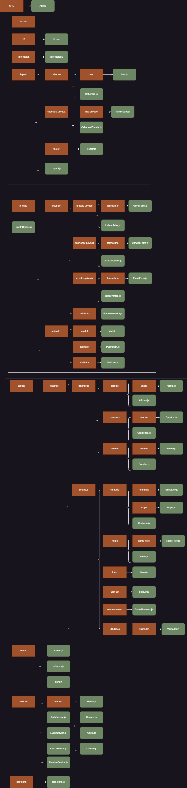
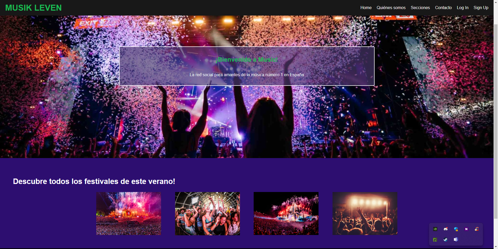
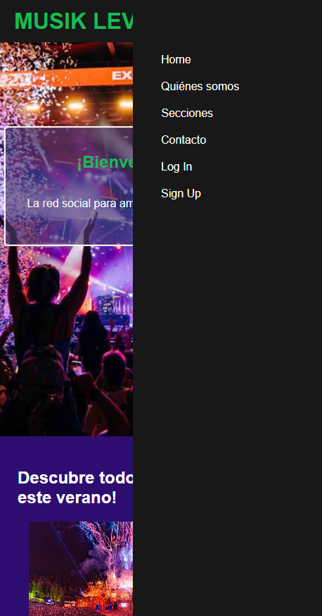

# Estructura del Proyecto

El proyecto está organizado de la siguiente manera:

## /assets

El directorio `assets` alberga todos los recursos estáticos de la aplicación, como imágenes, audio, vídeos, etc. Estos recursos pueden ser referenciados en cualquier parte de la aplicación y normalmente no cambian durante la ejecución de la aplicación.

## /DB

Este directorio contiene el archivo `db.js`, que representa una base de datos simulada y contiene datos estáticos.

## /interceptor

El directorio `interceptor` contiene el archivo `Interceptor.js`, responsable de interceptar solicitudes y respuestas HTTP. Este archivo podría utilizarse para tareas como agregar tokens de autorización a todas las solicidades salientes o manejar errores globalmente para todas las respuestas entrantes.

## /Layout

El directorio `Layout` alberga varios componentes que definen la estructura visual global de la aplicación:

- `/cabecera/nav/Nav.js` - Define la barra de navegación para usuarios no autenticados. 
- `/cabecera/Cabecera.js` - Es el componente principal de la cabecera que se muestra en todas las páginas.
- `/cabecera-privada/nav-privado/NavPrivado.js` - Define la barra de navegación para usuarios autenticados.
- `/cabecera-privada/CabeceraPrivada.js` - Es la versión de la cabecera para usuarios autenticados.
- `/footer/Footer.js` - Define el componente del pie de página de la aplicación.
- `Layout.js` - Es el componente de diseño principal que se utiliza para envolver todas las rutas de la aplicación.

## Parte Privada

### /privada/paginas

Contiene varias subcarpetas que representan las diferentes secciones de la parte privada de la aplicación:

- `/artistas-privado/formulario/ArtistaForm.js` y `ListaArtistas.js` - Componentes relacionados con la gestión de artistas.
- `/canciones-privado/formulario/CancionForm.js` y `ListaCanciones.js` - Componentes para manejar canciones.
- `/eventos-privado/formulario/EventForm.js` y `ListaEventos.js` - Componentes relacionados con la gestión de eventos.
- `/estaticas` - Incluye páginas estáticas de la sección privada de la aplicación, como la página de inicio privada (PrivateHomePage).

### /privada/PrivateRoutes.js

Este archivo define todas las rutas privadas que solo están accesibles para los usuarios que han iniciado sesión en la aplicación.

### /privada/utilidades

Contiene varias utilidades:

- `/modal/Modal.js` - Componente modal reutilizable.
- `/paginator/Pagination.js` - Componente de paginación reutilizable.
- `/validator/Validator.js` - Clase de utilidad para realizar validaciones de entrada en los formularios.

## Parte Pública

### /publica/paginas

Contiene varias subcarpetas que representan las diferentes secciones de la parte pública de la aplicación:

- `/dinamicas/artistas/artista/artista.js` y `Artistas.js` - Componentes relacionados con la visualización de artistas.
- `/dinamicas/canciones/cancion/Cancion.js` y `Canciones.js` - Componentes para visualizar canciones.
- `/dinamicas/eventos/evento/Evento.js` y `Eventos.js` - Componentes relacionados con la visualización de eventos.
- `/estaticas/contacto/Contacto.js`, `formulario/Formulario.js` y `mapa/Mapa.js` - Componentes para la página de contacto.
- `/estaticas/home/Home.js` y `home-hero/HomeHero.js` - Componentes para la página de inicio.
- `/estaticas/login/Login.js` y `/sign-up/SignUp.js` - Componentes para las páginas de inicio de sesión y registro.
- `/estaticas/sobre-nosotros/SobreNosotros.js` - Componente para la página "Sobre nosotros".

### /publica/utilidades

Contiene varias utilidades:

- `/validator/Validator.js` - Clase de utilidad para validar las entradas del formulario.

## /redux

El directorio `redux` contiene todo el código relacionado con la gestión del estado global de la aplicación mediante Redux:

- `actions.js` - Donde se definen todas las acciones de Redux.
- `reducers.js` - Contiene los reductores de Redux.
- `store.js` - Donde se crea y configura el almacén de Redux.

## /servicios

El directorio `servicios` contiene código para interactuar con servicios backend y manipular modelos de datos:

- `AuthService.js` - Servicio que maneja la autenticación de los usuarios.
- `EventService.js`, `ArtistaService.js` y `CancionService.js` - Servicios para manejar operaciones de backend relacionadas con eventos, artistas y canciones respectivamente.
- `/modelo/Evento.js`, `Usuario.js`, `Artista.js` y `Cancion.js` - Archivos que definen las estructuras de los datos.

## /not-found

El directorio `not-found` contiene un único componente llamado `NotFound.js` que se muestra cuando un usuario navega a una ruta que no existe en la aplicación.

# Diagrama de la aplicación

A continuación se muestra el diagrama de la aplicación:

## Capturas de pantalla de la aplicación

A continuación, se muestran algunas capturas de pantalla de la aplicación:

Escritorio

Mobile

## Primeros pasos

Para comenzar con Musik Leven, sigue estos pasos:

1. Clona el repositorio:

2. Navega al directorio del proyecto:

3. Instala las dependencias: (npm install)

4. Inicia la aplicación: (npm start)

5. Navega hasta la carpeta DB (la encontraras en la raiz de la app)

6. Levanta la base de datos (json-server --watch db.json)

7. Abre tu navegador y visita `http://localhost:3000` para acceder a Musik Leven.

## Contribuciones

¡Las contribuciones son bienvenidas! Si deseas contribuir a Musik Leven, sigue estas pautas:

1. Haz un fork del repositorio.
2. Crea una nueva rama para tu funcionalidad o corrección de errores.
3. Realiza tus cambios con mensajes descriptivos en los commits.
4. Sube tus cambios a tu fork.
5. Envía una pull request a la rama `main` del repositorio original.

Asegúrate de que tu código cumpla con el estilo de codificación existente e incluya la documentación adecuada y una cobertura de pruebas apropiada.

## Autores

Esta sección lista a todos los autores del proyecto, ordenados alfabéticamente por su primer apellido.

Si tienes alguna pregunta, sugerencia o problema, no dudes en contactarnos a 
- [José Antonio Del Rey Martínez](https://github.com/Janto7).
- [Rubén Magaz](https://github.com/nergal98).
- [Sergio Romero](https://github.com/sergior-15).
